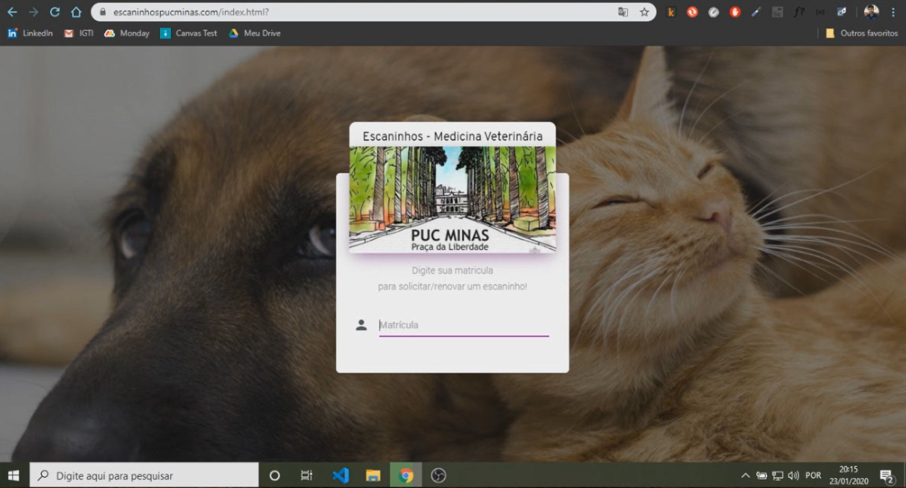
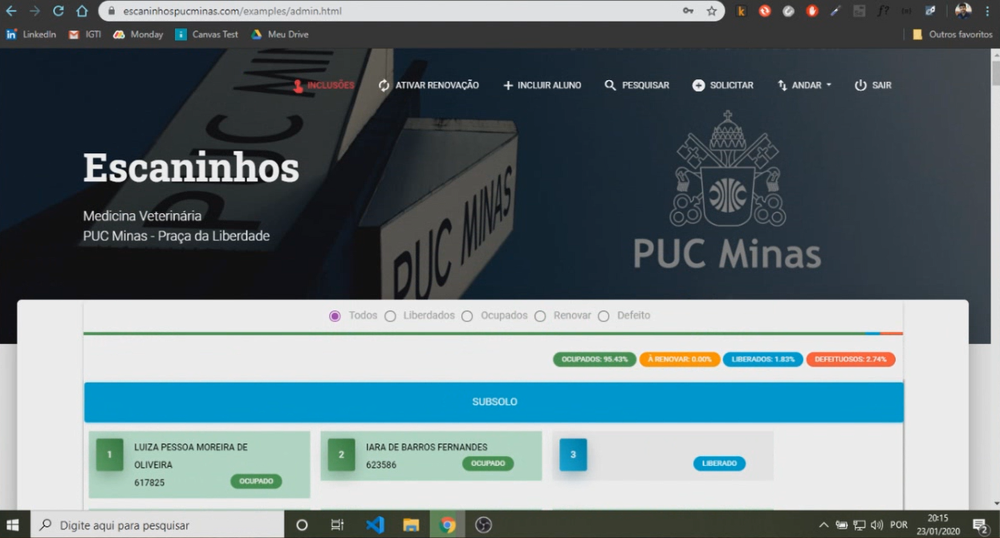
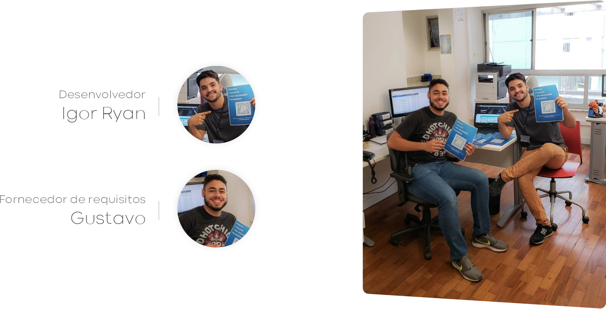

<h3 align="center">

</h3>

<h1 align="center">Plataforma dos Escaninhos</h1>

A plataforma dos escaninhos foi desenvolvida para auxiliar e otimizar o gerenciamento dos compartimentos disponibilizados aos alunos. Além de ter sido meu primeiro projeto publicado.

<a href="https://youtu.be/omsPSC1DbAI"> View User Experience and Design on Youtube.</a> 

### Implementação

Abaixo estão descritas as funcionalidades implementadas.

| Funcionalidades administrador | Propósito |
| ------ | ------ |
| Verificar inclusões | A cor do botão indica se há solicitações de inclusão pendentes, quando acionado, exibe as solicitações de inclusão. |
| Ativar renovação | Reinicia todos os relacionamentos entre compartimento e respectivo aluno, permitindo que o antigo proprietário efetive a renovação, garantindo novamente o compartimento para o semestre vigente. Caso o aluno não renove, o compartimento é liberado. |
| Incluir aluno | Relaciona um aluno a um compartimento. |
| Pesquisar | Busca um compartimento, a partir de um número de matricula. |
| Solicitar | Posiciona um aluno na fila de espera. |
| Andar | Permite fazer um switch por andar (os compartimento são organizados fisicamente nos andares do prédio em que o curso ocorre). |
| Filtro por situação |▸ Todos: Exibe todos os compartimentos cadastrados;  ▸ Liberados: Exibe compartimentos disponíveis;  ▸ Ocupados: Exibe compartimentos ocupados;  ▸ Renovar: Exibe compartimentos pendentes de renovação;  ▸ Defeito: Exibe compartimentos com defeito(s). |
| Estátisticas | Apresenta a porcentagem de cada estado (ocupados, à renovar, liberados e defeituosos). |
| Clique sobre compartimento|▸ Liberado: Permite alocar um aluno da lista de espera e mudar situação para defeituoso;  ▸ Ocupado: Permite desalocar o aluno proprietário;  ▸ Renovar: Permite a renovação manual;   ▸ Defeituoso: Permite alterar o estado para concertado, tornando o compartimento liberado.|

| Funcionalidades aluno | Propósito |
| ------ | ------ |
| Solicitar | Envia uma solicitação para adquirir um compartimento. |
| Renovar | Renova o compartimento para uso no semestre vigente.|
| Trocar| Envia uma solicitação de troca. |
| Abandonar| Abandona o compartimento.|
| Exibir | Por padrão, o compartimento é exibido caso o aluno possua um.|

### Tecnologias utilizadas

- HTML / CSS / JavaScript;
- Framework Material Design (template);
- Google Firebase;
- QR Code.

### Screenshots das telas

-------

<h6 align="center"></h6>

<i>Foto com Gustavo Verine, na época, auxiliar de infraestrutura e colega de trabalho, além de ter sido o principal cliente do projeto. Era função dele verificar compartimento um a um, fazendo uma "varredura" afim de verificar o estado, disponibilidade e relação. E função do aluno, ir até a secretária para registrar, renovar, trocar e abandonar um compartimento.
