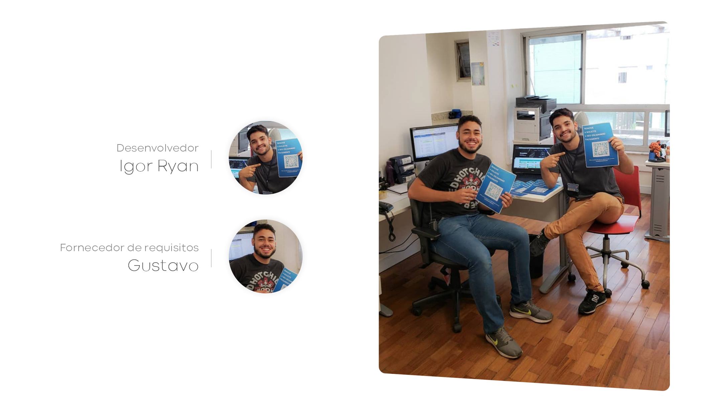

<h3 align="center">

</h3>

<h1 align="center">Plataforma dos Escaninhos</h1>

A plataforma dos escaninhos foi desenvolvida para auxiliar e otimizar o gerenciamento dos compartimentos disponibilizados aos alunos. Além de ter sido meu primeiro projeto publicado.

<a href="https://youtu.be/omsPSC1DbAI" target="_blank"> Watch User Experience and Design on Youtube.</a> 

### Tecnologias utilizadas

- HTML / CSS / JavaScript;
- Framework Material Design (template);
- Google Firebase;
- QR Code.

### Funcionalidades do administrador:

- CRUD de aluno;
- Verificar solicitações;
- Ativar renovação semestral;
- Pesquisar por aluno;
- Fila de espera;
- Filtro por localização do escaninho no edifício;
- Filtro por situação do escaninho;
- Estátisticas dos compartimentos.

### Funcionalidades do aluno:

- Solicitar, renovar, trocar, abandonar e exibir escaninho.

### Screenshots das telas

Interface do aluno <a href="https://youtu.be/omsPSC1DbAI" target="_blank"> Watch User Experience and Design on Youtube.</a> 

Plataforma do administrador <a href="https://youtu.be/omsPSC1DbAI" target="_blank"> Watch User Experience and Design on Youtube.</a> 

-------

<h6 align="center"></h6>

